<a href="https://felixthedev.com">
<picture>
  <source media="(prefers-color-scheme: dark)" srcset="assets/header-dark.svg">
  
</picture>
</a>

Ich entwickle Software für die öffentliche Verwaltung: Werkzeuge, die Kolleginnen und Kollegen jeden Tag benutzen und die deshalb ohne Anleitung funktionieren müssen. Drei Dinge sind mir dabei wichtig. Nichts von fremden Servern laden. Personendaten nur verschlüsselt ablegen. Oberflächen, die auch auf dem Handy nicht aus dem Tritt kommen.

<picture>
  <source media="(prefers-color-scheme: dark)" srcset="assets/river-dark.svg">
  
</picture>

<picture>
  <source media="(prefers-color-scheme: dark)" srcset="assets/stats-dark.svg">
  
</picture>

### Womit ich arbeite

<picture>
  <source media="(prefers-color-scheme: dark)" srcset="assets/stack-dark.svg">
  
</picture>

<b>Mehr über mich</b>

 

- **Wo:** In einer Amtsverwaltung in Schleswig-Holstein, als Auszubildender in der IT.
- **Was:** Formular- und Rückmeldedienste, Werkzeuge für den Verwaltungsalltag, alles auf eigener Hardware.
- **Wie:** Node.js und .NET, SQLite, Docker. Keine CDNs, keine Tracker, keine fremden Schriften.
- **Warum:** Verwaltung verdient Software, die man gern benutzt.
- **Web:** [felixthedev.com](https://felixthedev.com)

<b>Wie diese Seite entsteht</b>

 

Die Grafiken oben kommen von keinem fremden Dienst. Ein kleines Skript in diesem Repository ([`scripts/build.js`](scripts/build.js)) holt einmal am Tag die Zahlen von der GitHub-API, rechnet Serien und Wochentage aus und zeichnet daraus die SVG-Dateien in [`assets/`](assets). Ohne Abhängigkeiten, ohne Tracker. Wer diese Seite aufruft, lädt nichts von irgendwo anders.

Die Animationen stecken direkt im SVG (SMIL), deshalb laufen sie auch ohne JavaScript. Texte und Stack stehen in [`profile.json`](profile.json), die Farben in [`scripts/theme.js`](scripts/theme.js). Wer das für das eigene Profil nachbauen möchte: forken, `profile.json` anpassen, ein Token als Secret `PROFILE_TOKEN` hinterlegen, fertig.

<!-- updated:start -->Stand: 21. September 2026<!-- updated:end -->
