<a href="https://felixthedev.com">
<picture>
  <source media="(prefers-color-scheme: dark)" srcset="assets/header-dark.svg">
  
</picture>
</a>

I build software for public administration: tools my colleagues use every day, which is why they have to work without a manual. Three things matter to me. Load nothing from third-party servers. Store personal data encrypted or not at all. Build interfaces that hold up on a phone. On the side I make games on Roblox.

<picture>
  <source media="(prefers-color-scheme: dark)" srcset="assets/skyline-dark.svg">
  
</picture>

<picture>
  <source media="(prefers-color-scheme: dark)" srcset="assets/stats-dark.svg">
  
</picture>

### What I work with

<picture>
  <source media="(prefers-color-scheme: dark)" srcset="assets/skills-dark.svg">
  
</picture>

### Where to find me

<!-- links:start -->
<a href="https://felixthedev.com"><picture><source media="(prefers-color-scheme: dark)" srcset="assets/link-website-dark.svg"></picture></a>
<a href="https://www.roblox.com/users/profile?username=f_lixthedev"><picture><source media="(prefers-color-scheme: dark)" srcset="assets/link-roblox-dark.svg"></picture></a>
<picture><source media="(prefers-color-scheme: dark)" srcset="assets/link-discord-dark.svg"></picture>
<a href="https://www.tiktok.com/@f_lixthedev"><picture><source media="(prefers-color-scheme: dark)" srcset="assets/link-tiktok-dark.svg"></picture></a>
<a href="https://sky.shiiyu.moe/stats/FelixTheDev"><picture><source media="(prefers-color-scheme: dark)" srcset="assets/link-skyblock-dark.svg"></picture></a>
<!-- links:end -->

<b>More about me</b>

 

- **Where:** A municipal administration in Schleswig-Holstein, Germany, as an IT apprentice.
- **What:** Form and feedback services, tools for everyday administration, all on our own hardware.
- **How:** Node.js and .NET, SQLite, Docker. No CDNs, no trackers, no external fonts.
- **Also:** Games on Roblox written in Luau, and Hypixel SkyBlock when nothing is compiling.
- **Why:** Public administration deserves software people enjoy using.

<b>How this page is built</b>

 

None of the graphics above come from a third-party service. A small script in this repository ([`scripts/build.js`](scripts/build.js)) fetches the numbers from the GitHub API once a day, works out streaks and weekdays, and draws the SVG files in [`assets/`](assets). No dependencies, no trackers. Visiting this page loads nothing from anywhere else.

The animations live inside the SVG files (SMIL), so they run without JavaScript. Texts, skills and links are in [`profile.json`](profile.json), the colours in [`scripts/theme.js`](scripts/theme.js). To reuse it for your own profile: fork, edit `profile.json`, add a token with `read:user` as the secret `PROFILE_TOKEN`, done.

<!-- updated:start -->Updated September 21, 2026<!-- updated:end -->
